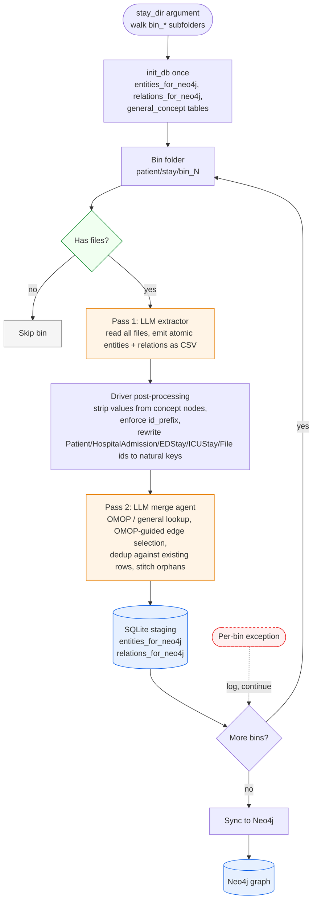
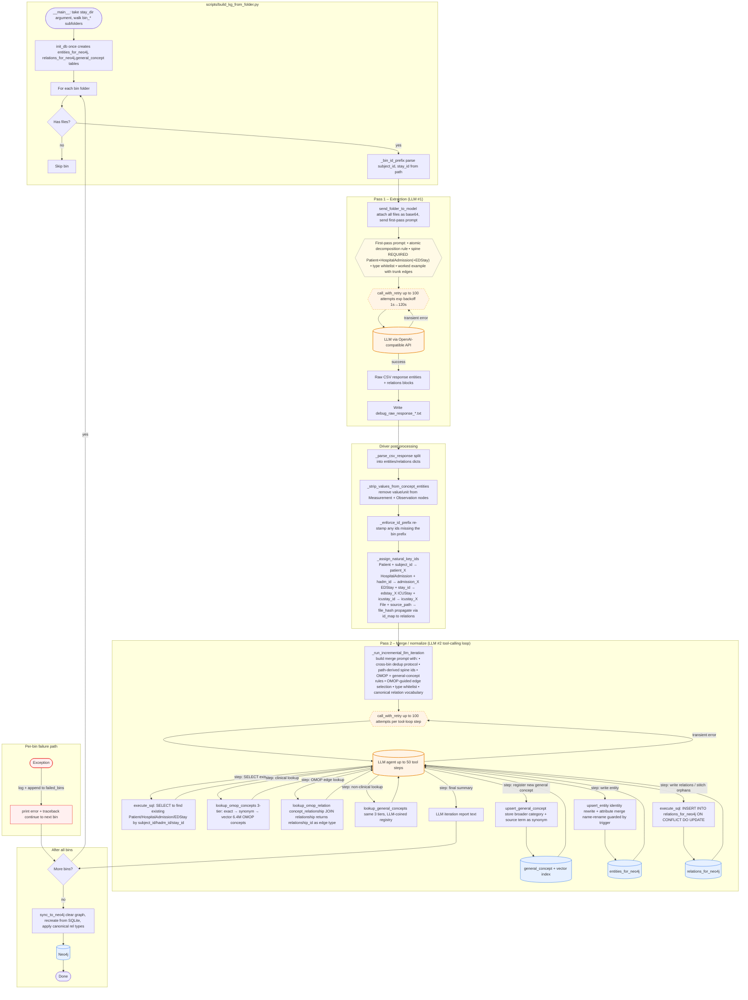

# Medical-KG

Builds a clinical Knowledge Graph from patient time-bin folders. Each bin (raw CSVs, free-text notes, ECG headers, PDFs) is run through a two-pass LLM pipeline that decomposes the content into atomic entities, normalizes them against OMOP (and a learned non-clinical vocabulary), and merges everything into a connected per-patient subgraph in SQLite. The graph is then synced to Neo4j. A Streamlit chat UI lets you query the graph in plain English via LLM-generated Cypher.

## Structure

- `src/` — Core logic and modules
- `scripts/` — Manually runnable scripts/jobs
- `explorer/` — Streamlit chat UI for querying the KG via natural language
- `tests/` — Unit and integration tests
- `logs/` — Generated artifacts and debug output (raw LLM responses, etc.)

## Pipeline overview



Orange nodes are LLM calls, blue nodes are persistent stores, green is the empty-bin gate, red-dashed is the per-bin failure path. See [Detailed pipeline](#detailed-pipeline) for the per-tool breakdown.

## Architecture

The SQLite database (`data/medical_kg.sqlite`) serves four purposes:

1. **OMOP Vocabulary** — `concept`, `concept_synonym`, `domain`, etc. used as lookup for standardizing clinical LLM outputs.
2. **OMOP Concept Embeddings** — `concept_vec` (`sqlite-vec` virtual table, ~10 GB at 384-dim for 6.4M concepts) + `concept_embedding_meta`, one vector per concept (canonical name + synonyms as context). Used as the third tier of `lookup_omop_concepts`. See [OMOP Concept Embeddings](#omop-concept-embeddings).
3. **General-Concept Registry** — `general_concept`, `general_concept_synonym`, `general_concept_embedding_meta`, `general_concept_vec`. A parallel of OMOP for the non-clinical content the LLM extracts from notes (hobbies, foods, devices, …). Starts empty; grows as the LLM coins broader categories. See [General-Concept Registry](#general-concept-registry).
4. **Neo4j Staging** — `entities_for_neo4j` and `relations_for_neo4j` hold the normalized output. Synced to the external Neo4j instance via `sync_to_neo4j()`.

Every entity's `type` is clamped to a closed whitelist defined in `src/queries/entity_types.py` — see [Entity Type Whitelist](#entity-type-whitelist).

Every relationship type follows a canonical ontology enforced at Neo4j write time — see [Graph Ontology](#graph-ontology).

## Two-pass design

Each bin is processed by **two separate LLM calls**:

**Pass 1 — Extraction** (`scripts/build_kg_from_folder.py:send_folder_to_model`). One-shot. Reads all files in the bin (CSVs, free-text notes, image base64, ECG headers) and emits two CSV blocks: `entities` and `relations`. The prompt mandates **atomic decomposition** (every clinical or non-clinical concept that a vocabulary could plausibly look up gets its own entity row), a **spine** (every bin must emit a `Patient`, a `HospitalAdmission` (or `EDStay` for ED-only visits), with `subject_id`/`stay_id`/`hadm_id` in attributes, and every top-level container must have an edge to one of them), and **values on edges** (Measurement and Observation nodes hold only concept-identity fields — `source_term`, `ref_range_lower/upper`, `unit_of_measure`; recorded `value`/`valueuom`/`valuenum` belong exclusively on the relation edge with the timestamp, so a single Creatinine node accumulates one edge per timepoint).

**Pass 2 — Merge / normalize** (`scripts/build_kg_from_folder.py:_run_incremental_llm_iteration`). A tool-calling loop (up to 50 steps). The agent gets six tools:

- `execute_sql` — arbitrary SQL against SQLite (SELECT/INSERT/UPDATE/DELETE/DDL). Used both for exploration and for stitching missing relations.
- `lookup_omop_concepts` — three-tier OMOP search (exact → synonym → vector), see [OMOP Concept Embeddings](#omop-concept-embeddings).
- `lookup_general_concepts` — mirror tool over the general-concept registry.
- `upsert_entity` — writes one row to `entities_for_neo4j`. Handles **identity rewrite** (Patient with `subject_id` becomes `patient_<id>`, HospitalAdmission with `hadm_id` becomes `admission_<hadm_id>`, EDStay with `stay_id` becomes `edstay_<stay_id>`, File with `source_path` becomes `file_<hash>`) and **attribute merge** (non-empty wins; lists are unioned across bins). Cross-bin duplicates collapse via `INSERT … ON CONFLICT(id) DO UPDATE`.
- `upsert_general_concept` — registers a new canonical name in the general-concept registry. The LLM is required to pick a **broader category** than the source term (`PlayStation → Gaming console`, not `PlayStation → PlayStation`) so the next mention of `Xbox` vector-matches to the same canonical.
- `lookup_omop_relation` — queries `concept_relationship` (39 M rows) joined with the `relationship` registry for valid edges between two OMOP concept IDs. Called **before** any edge is inserted when both endpoints carry an `omop_concept_id`. If a match is found, its `relationship_id` (e.g. `May treat`, `Is a`) becomes the edge `type` in `relations_for_neo4j`, taking precedence over the closed relation vocabulary. If no match is found, the agent must reconsider whether the edge is needed at all rather than defaulting to a structural type. See [OMOP-guided edge selection](#omop-guided-edge-selection).

Between the two passes, the driver does pure-Python post-processing: strips `value`/`valuenum`/`valueuom`/`unit` from any Measurement or Observation entity (a backstop enforcing the values-on-edges rule even if the LLM regresses), re-stamps any bin-prefix the LLM forgot, and rewrites Patient/HospitalAdmission/EDStay/ICUStay/File ids to their natural-key form so duplicates collapse before the merge agent ever sees them.

A SQL trigger `guard_entity_rename` refuses any `UPDATE` that changes an existing entity's `name` to a substantively different value — a safety net against id collisions overwriting unrelated entities.

## Resilience

Both LLM calls and the outer bin loop are hardened for production deployments where the API or network may be unstable.

### Per-call retry (`src/connection.py:call_with_retry`)

Every `client.chat.completions.create(...)` call — in both Pass 1 and the Pass 2 tool loop — is wrapped in `call_with_retry`. It retries up to `LLM_MAX_RETRIES` times (default 100) with exponential backoff:

```
wait = min(base_delay × 2^attempt, max_delay) ± 10% jitter
     = 1 s, 2 s, 4 s, … 64 s, 120 s, 120 s, …  (defaults)
```

Fatal errors (`AuthenticationError`, `BadRequestError`, `DeploymentNotFound`) are re-raised immediately without retrying. All other exceptions (rate limits, timeouts, connection errors, 5xx) are retried. Each attempt prints a `[retry] attempt N/100` line to stdout.

Tune via `.env`:

| Variable | Default | Meaning |
|---|---|---|
| `LLM_MAX_RETRIES` | `100` | Max attempts per API call |
| `LLM_BASE_DELAY` | `1.0` | Initial backoff in seconds |
| `LLM_MAX_DELAY` | `120.0` | Backoff cap in seconds |

### Per-bin fault tolerance (`scripts/build_kg_from_folder.py`)

The outer bin loop catches exceptions per bin and continues to the next one rather than aborting the entire run. Failed bin paths are collected in `failed_bins` and printed as a summary at the end of the run.

`sync_kg_to_neo4j()` always runs at the end, even when some bins failed, so the KG built so far is always synced.

## Detailed pipeline



Notes:
- **Two LLM calls per bin.** Pass 1 is single-shot. Pass 2 is a tool-calling loop that can call SELECT, both lookups, both upserts, `lookup_omop_relation`, and `execute_sql` up to 50 times before producing its final summary.
- **Every LLM call retries up to 100 times** with exponential backoff. A transient network error or rate limit does not crash the bin.
- **The post-processing block is pure Python**, no LLM. It's the load-bearing dedup machinery — `_assign_natural_key_ids` is what makes the same patient across multiple bins collapse to one row before the merge agent ever sees the data. `_strip_values_from_concept_entities` enforces the values-on-edges rule even if the LLM regresses.
- **Per-bin fault isolation.** If a bin fails, the exception is caught, the path is appended to `failed_bins`, and the run continues with the next bin. Failed bins are reported at the end.
- **One Neo4j sync at the end**, after all bins have merged. Not per-bin — this avoids partial-graph states during processing.
- **The loop arrow back to `loop`** is critical: each bin's merge runs against the cumulative DB state, so bin_1 can dedup against what bin_0 already wrote.

## Graph Ontology

All relationship types in Neo4j follow a canonical closed vocabulary. The mapping is enforced in `src/database.py:_CANONICAL_REL_TYPE` at sync time: regardless of what the LLM wrote in SQLite, the correct type is applied when writing to Neo4j. All types are `UPPERCASE_WITH_UNDERSCORES`.

**OMOP-derived relations take priority.** When both endpoints of an edge carry an `omop_concept_id` and `lookup_omop_relation` found a match, the OMOP `relationship_id` (e.g. `MAY_TREAT`, `IS_A`) is preserved and the canonical table is not applied.

### Canonical relationship table

| Source | Target | Relationship Type | Semantics |
|---|---|---|---|
| **Patient spine** | | | |
| Patient | HospitalAdmission | `HAS_ADMISSION` | |
| Patient | EDStay | `HAS_ED_STAY` | ED-only fallback when no hadm_id exists |
| Patient | Allergy | `HAS_ALLERGY` | |
| Patient | Condition | `HAS_CONDITION_IN_PMH` | Pre-existing / PMH conditions |
| Patient | Observation | `HAS_CONDITION_IN_PMH` | PMH observations ("Hx of skin cancer") |
| Patient | Race | `HAS_DEMOGRAPHICS` | |
| Patient | Gender | `HAS_DEMOGRAPHICS` | |
| Patient | Measurement | `HAS_BASELINE_RESULT` | Baseline lab/vital results (e.g. CD4 count, PFT) |
| Patient | Procedure | `HAS_BASELINE_RESULT` | Procedures that establish a baseline |
| Patient | Drug | `HAS_CHRONIC_MEDICATION` | Chronic / home medications (e.g. HAART) |
| Patient | SocialHistory | `HAS_SOCIAL_HISTORY` | Substance use, lifestyle history |
| Patient | Note | `HAS_NOTE` | |
| **HospitalAdmission** | | | |
| HospitalAdmission | EDStay | `HAS_ED_STAY` | |
| HospitalAdmission | ICUStay | `HAS_ICU_STAY` | |
| HospitalAdmission | Condition | `DOCUMENTS_DIAGNOSIS` | Admission-level diagnoses |
| HospitalAdmission | Note | `HAS_NOTE` | Discharge notes, radiology reports |
| HospitalAdmission | Transfer | `INCLUDES_TRANSFER` | |
| HospitalAdmission | Demographics | `HAS_ENCOUNTER_CONTEXT` | |
| **EDStay** | | | |
| EDStay | Condition | `DOCUMENTS_DIAGNOSIS` | Chief complaint and confirmed diagnoses |
| EDStay | Observation | `DOCUMENTS_FINDING` | Clinical findings ("Anicteric sclera", "No acute distress") |
| EDStay | Drug | `ADMINISTERED_MED` | Medications given during the ED stay |
| EDStay | Measurement | `RECORDED_VITAL` | Vitals and labs recorded at the ED stay |
| EDStay | Note | `HAS_NOTE` | |
| EDStay | SignalRecord | `HAS_ECG` | |
| EDStay | Transfer | `INCLUDES_TRANSFER` | |
| EDStay | Demographics | `HAS_ENCOUNTER_CONTEXT` | |
| **ICUStay** | | | |
| ICUStay | Condition | `DOCUMENTS_DIAGNOSIS` | |
| ICUStay | Observation | `DOCUMENTS_FINDING` | |
| ICUStay | Drug | `ADMINISTERED_MED` | |
| ICUStay | Measurement | `RECORDED_VITAL` | |
| ICUStay | Note | `HAS_NOTE` | |
| **Note** | | | |
| Note | Condition | `DOCUMENTS_DIAGNOSIS` | Diagnoses mentioned in the note |
| Note | Drug | `DOCUMENTS_MEDICATION` | Any drug mentioned in the note |
| Note | Measurement | `DOCUMENTS_FINDING` | |
| Note | Observation | `DOCUMENTS_FINDING` | |
| Note | Procedure | `DOCUMENTS_FINDING` | |
| Note | SocialHistory | `DOCUMENTS_FINDING` | |
| Note | Specimen | `DOCUMENTS_FINDING` | |
| **Other** | | | |
| Allergy | Drug | `ALLERGEN_IS` | The drug that is the allergen |
| SignalRecord | SignalLead | `HAS_LEAD` | |
| SignalRecord | File | `HAS_SOURCE_FILE` | |
| Demographics | Measurement | `DOCUMENTS_FINDING` | |
| Demographics | Observation | `DOCUMENTS_FINDING` | |
| Drug | Route | `ADMINISTERED_VIA` | |

### Removed / consolidated types

The following types from earlier versions of the graph are no longer used:

| Removed type | Replaced by |
|---|---|
| `HAS_ENCOUNTER` | `HAS_ADMISSION` (Patient→HospitalAdmission) or `HAS_ED_STAY` (Patient→EDStay for ED-only) |
| `HAS_CHIEF_COMPLAINT` | `DOCUMENTS_FINDING` (EDStay→Observation) or `DOCUMENTS_DIAGNOSIS` (EDStay→Condition) |
| `DOCUMENTS_HOME_MED` | `DOCUMENTS_MEDICATION` — not all drugs mentioned in a Note are home medications |
| `DOCUMENTS_PROCEDURE` | `DOCUMENTS_FINDING` — procedures mentioned in Notes are findings, not a distinct edge category |

### Node labels

Node labels come from two groups:

**OMOP domains** (used verbatim): `Condition`, `Drug`, `Procedure`, `Measurement`, `Observation`, `Device`, `Specimen`, `Provider`, `Geography`, `Episode`, `Route`, `Unit`, `Spec Anatomic Site`, `Race`, `Ethnicity`, `Gender`

**Non-OMOP structural**: `Patient`, `Demographics`, `HospitalAdmission`, `EDStay`, `ICUStay`, `Transfer`, `File`, `Note`, `SignalRecord`, `SignalLead`, `Allergy`, `Immunization`, `FamilyHistory`, `SocialHistory`, `Unknown`

## Medical KG Explorer

The `explorer/` directory contains a Streamlit chat UI that lets you query the Neo4j graph in plain English.

```bash
streamlit run explorer/app.py
```

### Architecture

```
User question
    │
    ▼
classify_message()           ← cheap LLM call (max 5 tokens)
    │
    ├─ "chat" ──────────────→ chat_reply(question, history, schema=schema)
    │                          LLM answers using injected schema context
    │
    └─ "query" ─────────────→ normalize_question_terms(question)
                                   │  maps colloquial terms to OMOP canonical values
                                   ▼
                               plan_and_answer(question, schema, history, term_hints)
                                   │
                                   ├─ Round 1: LLM plans n queries (≥1, ≤10)
                                   │     │
                                   │     └─ n queries execute in PARALLEL (ThreadPoolExecutor)
                                   │
                                   ├─ Review: LLM inspects round-1 results
                                   │     │  If gaps found → plans m follow-up queries (n+m ≤ 10)
                                   │     └─ m queries execute in PARALLEL (optional)
                                   │
                                   └─ Synthesize: LLM generates one answer from all results
                                         Uses evidence reasoning rules:
                                           • path absence ≠ concept absence
                                           • rank by content match, not carrier type
                                           • discard unrelated results before concluding
                                           • show provenance for every finding
```

The multi-round parallel pipeline lets the LLM decompose complex questions into up to **10 Cypher queries** across **two rounds**, with all queries in each round executing concurrently. Round 2 is optional — it only fires when the LLM detects gaps or empty results in round 1. The total query count across both rounds is capped at 10.

The synthesis prompt enforces a five-step reasoning protocol: (1) set aside empty results — empty path ≠ concept absent; (2) score each non-empty result as strong match / partial match / unrelated; (3) conclude affirmatively if any strong or partial match exists on any carrier, regardless of carrier type; (4) cite provenance for every finding; (5) mention empty paths as context only, not as negative evidence.

The planner uses a **concept-first strategy**: for any clinical content question it first generates queries that start directly from the most relevant concept node type (e.g. `PROCEDURE` nodes for imaging questions, `MEASUREMENT` nodes for lab questions), filtered by name. These concept-first queries find nodes regardless of which path connects them to the patient spine — covering facts documented only in note subtrees as well as facts on the structured encounter spine. Spine-path queries (starting from `EDSTAY`, `HOSPITALADMISSION`) are generated as a complement to catch any instances that the concept-first search misses.

Each query's rationale, Cypher, and result count are shown in collapsible expanders below the answer. Failed queries are surfaced with their error message rather than crashing the pipeline — other successful queries' results are still used for synthesis.

### Schema grounding

`get_grounded_schema()` (cached with `@lru_cache`) runs live discovery queries against Neo4j at startup and injects the full schema into every LLM system prompt:

- All node labels and relationship types in the graph
- Every `(source_label)-[rel_type]->(target_label)` traversal path with edge counts
- `^^^WARNING` annotations when the same target label is reachable via multiple relationship types from the same source — the LLM is instructed to use `|` syntax to cover all paths

This means the Cypher generator always reflects the actual graph state, not a hardcoded schema, so new node types or relation types appear automatically.

### Term normalization

`normalize_question_terms()` scans the user question for 1–3 word phrases that match known demographic values. It builds its vocabulary from:

1. Live Neo4j nodes of type `Race`, `Gender`, `Ethnicity`
2. OMOP `concept_synonym` table for each of those canonical values

The resolved canonical values are passed as `TERM HINTS` to the Cypher generator, so `"black patients"` is translated to `"Black or African American"` before Cypher is written — not guessed by the LLM.

### Requirements

```
streamlit
openai
python-dotenv
neo4j
```

The explorer uses the same `.env` as the pipeline — no additional LLM keys are needed.

## LLM Tooling for SQLite

The merge agent has unrestricted SQL access plus five higher-level tools.

- Tool module: `src/queries/db_tooling.py`
- Runner: `scripts/llm_db_tool_runner.py`
- Tests: `tests/test_db_tooling.py`, `tests/test_general_concepts.py`

`execute_sql` allows arbitrary SELECT/INSERT/UPDATE/DELETE/DDL. The only blocks are destructive resets on the core staging tables (`DROP entities_for_neo4j`, `TRUNCATE relations_for_neo4j`, …) — those return an error message the LLM can read and recover from.

## OMOP-guided edge selection

When both the source and target entity of a candidate edge carry an `omop_concept_id`, the merge agent is required to call `lookup_omop_relation(concept_id_1, concept_id_2)` before inserting the edge.

- **Match found** — the returned `relationship_id` (e.g. `May treat`, `Is a`, `Has MoA`) becomes the edge `type` in `relations_for_neo4j`. This overrides the closed relation vocabulary. The edge attributes record `{"omop_relation": true, "relationship_name": "<name>"}`. Hierarchical relations (`is_hierarchical=1`) are preferred for taxonomy edges; clinical pharmacology relations are preferred for drug↔condition edges.
- **No match** — the agent must reconsider whether the edge is needed at all. Edges that add no meaning beyond what existing edges already capture are dropped. If still judged necessary, the fallback closed-vocabulary type is used and `{"omop_relation": false, "relation_note": "no OMOP relation found"}` is added to attributes.
- **One or both endpoints unmapped** — `lookup_omop_relation` is skipped; the closed vocabulary applies directly.

OMOP `relationship_id` strings (mixed-case, e.g. `"May treat"`) are uppercased and space-replaced on the way into Neo4j (`MAY_TREAT`, `IS_A`) by `_sanitize_neo4j_label` in `src/database.py`, consistent with Neo4j relationship-type naming convention.

The `concept_relationship` table has compound indexes on `(concept_id_1, concept_id_2)` and `(concept_id_2, concept_id_1)` so each lookup returns in ~2 ms against the 39 M-row table.

## Data Setup

**The `data/` folder is not included in this repository.** You must create it and populate it before any run will succeed.

### Required folder structure

```
data/
├── OMOP/                          # OMOP CDM vocabulary CSVs (download separately)
│   ├── CONCEPT.csv
│   ├── CONCEPT_ANCESTOR.csv
│   ├── CONCEPT_CLASS.csv
│   ├── CONCEPT_CPT4.csv
│   ├── CONCEPT_RELATIONSHIP.csv
│   ├── CONCEPT_SYNONYM.csv
│   ├── DOMAIN.csv
│   ├── DRUG_STRENGTH.csv
│   ├── RELATIONSHIP.csv
│   └── VOCABULARY.csv
└── medical_kg.sqlite              # Generated by the pipeline — do not create manually
```

### OMOP vocabulary

Download the OMOP CDM vocabulary files from [Athena (OHDSI)](https://athena.ohdsi.org/). Select all vocabularies, download the ZIP, and extract the CSV files into `data/OMOP/`.

Once the CSVs are in place, import them into SQLite and build the embedding index:

```bash
# 1. Import OMOP tables into SQLite (~10–20 min)
python scripts/import_omop_to_sqlite.py

# 2. Build the vector embedding index (~2 hours on Apple Silicon, resumable)
python scripts/build_concept_embeddings.py
```

The resulting `data/medical_kg.sqlite` file will be ~38 GB (OMOP tables + 6.4 M concept vectors at 384-dim).

---

## Quick Start

### Prerequisites

`.env` must contain:

```
POE_API_KEY=...
POE_MODEL=...
NEO4J_URI=...
NEO4J_USER=...
NEO4J_PASSWORD=...
NEO4J_DATABASE=...
```

Optional variables and their defaults:

| Variable | Default | Meaning |
|---|---|---|
| `SQLITE_DB_PATH` | `data/medical_kg.sqlite` | SQLite database path |
| `EMBEDDING_MODEL` | `BAAI/bge-small-en-v1.5` | Sentence-transformer model for OMOP vectors |
| `EMBEDDING_DIM` | `384` | Embedding dimension — must match the model and existing index |
| `POE_TIMEOUT` | `180` | Per-request timeout in seconds |
| `LLM_MAX_RETRIES` | `100` | Max retry attempts per LLM call |
| `LLM_BASE_DELAY` | `1.0` | Initial backoff delay in seconds |
| `LLM_MAX_DELAY` | `120.0` | Backoff cap in seconds |

### Import OMOP Vocabulary

Run once before the first KG build:

```bash
python scripts/import_omop_to_sqlite.py
```

Import only specific tables (e.g. for synonym mapping):

```bash
python scripts/import_omop_to_sqlite.py --tables concept concept_synonym concept_relationship
```

The import script also creates the lookup indexes and runs `ANALYZE`:

| Index | Table | Purpose |
|---|---|---|
| `idx_concept_name`, `idx_concept_name_lower` | `concept` | Exact and case-insensitive name lookup |
| `idx_concept_synonym_name`, `idx_concept_synonym_name_lower` | `concept_synonym` | Synonym lookup |
| `idx_concept_concept_id` | `concept` | Concept ID join |
| `idx_cr_concept_pair` | `concept_relationship` | Forward pair lookup `(concept_id_1, concept_id_2)` |
| `idx_cr_reverse_pair` | `concept_relationship` | Reverse pair lookup `(concept_id_2, concept_id_1)` |
| `idx_relationship_id` | `relationship` | JOIN key for the relationship registry |

Without the `concept_relationship` pair indexes, `lookup_omop_relation` would full-scan the 39 M-row table; with them, it returns in ~2 ms.

### Build the OMOP embedding index

One-time, after the OMOP import:

```bash
pip install -r requirements.txt   # sentence-transformers, sqlite-vec, numpy

# Optional: validate end-to-end on a subset of clinical domains first
python scripts/build_concept_embeddings.py --domains Drug Condition Measurement Procedure Observation

# Full run (resumable; ~2 hours on Apple Silicon)
python scripts/build_concept_embeddings.py
```

See [OMOP Concept Embeddings](#omop-concept-embeddings) for tuning flags.

### Run the KG build

```bash
python scripts/build_kg_from_folder.py <stay_dir> [--max-bins N]
```

`stay_dir` is the path to a `time_bins_stay_*/` folder (absolute or relative to cwd):

```bash
# Process all bins for one stay
python scripts/build_kg_from_folder.py data/testData/Patients/time_bins_stay_31293660

# Process only the first 5 bins
python scripts/build_kg_from_folder.py data/testData/Patients/time_bins_stay_31293660 --max-bins 5
```

Bins are sorted numerically (`bin_0`, `bin_1`, … then `bin_dod`). When `--max-bins` is omitted, all bins are processed. The script prints total elapsed time when done.

The script prints total elapsed time and a summary of any failed bins when done.

### Neo4j Sync (standalone)

```bash
python scripts/sync_neo4j.py
```

Useful if you want to re-sync without re-running the LLM passes.

### Run the explorer

```bash
streamlit run explorer/app.py
```

## OMOP Concept Embeddings

To find the right OMOP concept for paraphrased, abbreviated, or morphologically-different clinical terms, the project maintains a vector index over OMOP, queried as the third tier of `lookup_omop_concepts`.

### What gets embedded

One vector per `concept_id`. The embedded text is the canonical name enriched with synonyms as context, e.g.

```
Atrial fibrillation. Also known as: AF; AFib; A-fib; auricular fibrillation; ...
```

The canonical name appears first so it dominates the embedding; synonyms reinforce the meaning without competing with it. Synonyms are deduplicated case-insensitively and capped at the shortest 8 (controlled by `MAX_SYNONYMS_PER_CONCEPT` in `src/queries/embeddings.py`).

### Storage

- `concept_embedding_meta(rowid PK = concept_id, concept_id, embed_text)` — one row per embedded concept; `embed_text` is kept for debugging.
- `concept_vec` — `sqlite-vec` virtual table, `embedding float[384]`, rowid equals concept_id.

Roughly ~10 GB of additional SQLite storage for the full ~6M concept corpus at 384-dim.

### Model

Default: `BAAI/bge-small-en-v1.5` (384-dim, fast, strong general-domain retrieval).

Override via the `EMBEDDING_MODEL` env var and set `EMBEDDING_DIM` accordingly (also via env var or by editing `src/queries/embeddings.py`).

For clinical-only quality, swap to `cambridgeltl/SapBERT-from-PubMedBERT-fulltext` (768-dim, biomedical entity linking). Requires dropping and rebuilding the index at the new dimension.

### Build flags

- `--domains <list>` — restrict to specific OMOP `domain_id` values.
- `--batch-size N` — embedding batch size; bump to 128–256 on GPU.
- `--chunk-size N` — concepts pulled from SQLite per round-trip.

The build script is resumable — it skips concept_ids already in `concept_embedding_meta`, so a Ctrl-C and re-run picks up where it left off. It prints rate (concepts/sec) and ETA every 5 seconds.

### Query path

Inside `_fetch_omop_candidates`:

1. **Exact** match on `concept_name` (score 1.0).
2. **Synonym-exact** match on `concept_synonym_name` (score 0.92).
3. **Vector** similarity over `concept_vec`, scaled into `[0, 0.9]` so a perfect cosine still ranks below an exact-name hit. Skipped if a ≥0.92 hit already exists, or if the index hasn't been built. Filtered by `domain_hint` when provided.

Tiers are sorted by `(standard_concept != 'S', -score, domain_rank, vocab_rank, name)` and the top-K returned. Each candidate carries a `match_type` (`exact` / `synonym` / `vector`) so the LLM can see which tier produced it.

The vocabulary rank (`vocab_rank`) ensures that when multiple standard concepts share the same name (e.g. "Heart rate" exists in both LOINC and SNOMED), the same `concept_id` is always returned regardless of which bin is processing:

| Vocabulary | Priority |
|---|---|
| LOINC | 0 (measurements, labs) |
| RxNorm | 0 (drugs) |
| SNOMED | 1 (conditions, observations, procedures) |
| ICD10CM / ICD9CM | 2 |
| NDC / CPT4 | 3 |
| Other | 9 |

If `sentence-transformers` / `sqlite-vec` aren't installed or the index hasn't been built, `lookup_omop_concepts` falls back to exact + synonym tiers only — no errors, just lower recall.

## General-Concept Registry

OMOP covers clinical concepts (drugs, conditions, procedures, …). Notes routinely mention things OMOP has no opinion about: hobbies (`jogging`), foods (`ramen`), devices (`PlayStation`), brands (`Netflix`). Without a place to land, the LLM either invents a fresh ad-hoc name per bin (duplicates in Neo4j) or marks them `Unknown`.

The general-concept registry is that place to land. It mirrors the OMOP infrastructure under a `general_` prefix:

| OMOP (read-only, ~6M concepts) | General (read+write, starts empty) |
|---|---|
| `concept` | `general_concept` |
| `concept_synonym` | `general_concept_synonym` |
| `concept_embedding_meta` + `concept_vec` | `general_concept_embedding_meta` + `general_concept_vec` |
| `lookup_omop_concepts` tool | `lookup_general_concepts` tool |
| Built from OMOP CSVs | Grown by the LLM via `upsert_general_concept` |

The merge prompt instructs the LLM, for any non-structural value extracted from a note, to call **both** `lookup_omop_concepts` and `lookup_general_concepts`, compare the best candidate from each, and pick the higher-confidence canonical. If both miss (best score < 0.8), the LLM calls `upsert_general_concept` — and the canonical name **must be a broader category than the source term**:

- `PlayStation` → canonical `Gaming console` (PlayStation kept as synonym)
- `ramen` → canonical `Noodle dish`
- `jogging` → canonical `Physical activity`
- `Netflix` → canonical `Streaming service`

This is the dedup mechanism: the next `Xbox` mention vector-matches against `Gaming console` instead of coining a second entry.

The registry only normalizes **names**, not types. Entity types still come from the whitelist; the new store doesn't introduce new ones. See `src/queries/general_concepts.py`.

## Cross-bin identity

The same logical Patient appears in every bin of that patient; the same HospitalAdmission or EDStay appears across every bin within a stay; the same clinical concept or structural container (e.g. "Heart rate", "History of Present Illness", "Penicillin allergy") appears in every bin that records it. Four mechanisms keep cross-bin duplicates from accumulating:

1. **Spine requirement in the first-pass prompt.** Every bin must emit a `Patient` row (with `subject_id` in attributes) and either a `HospitalAdmission` row (with `hadm_id`) or an `EDStay` row (with `stay_id`). Without these, the bin's content can't be natural-keyed and becomes an unreachable cloud.
2. **Driver-side natural-key rewrite** (`_assign_natural_key_ids` in `scripts/build_kg_from_folder.py`). Before the merge agent sees the parsed data, the driver rewrites entity ids to stable canonical forms based on type:

   | Entity type | Key attributes | Stable id pattern |
   |---|---|---|
   | Patient | `subject_id` | `patient_<subject_id>` |
   | HospitalAdmission | `hadm_id` | `admission_<hadm_id>` |
   | EDStay | `stay_id` | `edstay_<stay_id>` |
   | ICUStay | `icustay_id` | `icustay_<icustay_id>` |
   | File | `source_path` | `file_<sha1(path)[:12]>` |
   | Gender, Race | `omop_concept_id` | `gender_<concept_id>`, `race_<concept_id>` |
   | Measurement, Condition, Drug, Observation, Procedure, … | `omop_concept_id` | `<type_lower>_<omop_concept_id>` (e.g. `measurement_88674`) |
   | Allergy, Note, SignalRecord, SocialHistory, FamilyHistory, Immunization, Demographics, Transfer | `subject_id` + `source_term` (or `name`) | `<type_lower>_<subject_id>_<slug>` (e.g. `note_10000032_historyofpresentillness`) |

   All relations targeting the old bin-prefixed id are rewritten too, via the `id_map`.

3. **Merge-agent dedup protocol.** The merge prompt tells the agent to SELECT first by `subject_id`/`hadm_id`/`stay_id` before upserting a Patient/HospitalAdmission/EDStay, and gives it the path-derived natural-key ids as concrete strings so it can stitch orphan top-level containers to the existing spine. For structural containers, the prompt requires `subject_id` and `source_term` to always be set in attributes so the natural-key derivation fires.
4. **`upsert_entity` safety net.** The tool re-applies the natural-key rewrite at write time, so even if a bin-prefixed id slips through the driver, the row lands under its canonical id and merges its attributes into the existing row rather than creating a duplicate.

The result: concept nodes and structural containers are each represented once per patient; measurement values and timestamps live on the relationship edges (`RECORDED_VITAL`, `DOCUMENTS_FINDING`, etc.), not on the node.

## Entity Type Whitelist

Every entity's `type` must come from a fixed canonical set defined in `src/queries/entity_types.py`. The set has two halves:

- **OMOP domains** (used verbatim as Neo4j labels): `Condition`, `Drug`, `Procedure`, `Measurement`, `Observation`, `Device`, `Specimen`, `Provider`, `Geography`, `Episode`, `Route`, `Unit`, `Spec Anatomic Site`, `Race`, `Ethnicity`, `Gender`. Compound OMOP domains (`Drug/Measurement`, …) and metadata domains (`Type Concept`, `Metadata`, …) are intentionally excluded. **OMOP "Visit" is also excluded** — it overlaps semantically with our structural `HospitalAdmission` and is aliased to it instead. **OMOP "Person" is excluded** — patient identity belongs to the structural `Patient` below.
- **Non-OMOP structural types**: `Patient`, `Demographics`, `HospitalAdmission`, `EDStay`, `ICUStay`, `Transfer`, `File`, `Note`, `SignalRecord`, `SignalLead`, `Allergy`, `Immunization`, `FamilyHistory`, `SocialHistory`, `Unknown`.

The single resolver is `canonicalize_type(raw_type, omop_domain=None)`. Resolution order: OMOP domain (if recognized) > exact match against the whitelist > alias map (case- and punctuation-insensitive) > case-insensitive direct match > `Unknown`.

The whitelist is enforced at three points:

1. **Prompt** — the closed enum is embedded in the merge prompt; the LLM is told to pick `type` from it.
2. **OMOP lookup** — `lookup_omop_concepts` returns `canonical_type` per candidate (and at the top level), so the LLM gets the right answer handed to it.
3. **Neo4j sync** — `_canonical_entity_label` runs every entity's `type` through the resolver before it becomes a Neo4j label, preferring `attributes.omop_domain_id` over the raw type. This is the backstop.

Common aliases the LLM emits that get folded back: `Medication → Drug`, `ClinicalFinding → Condition`, `LabMeasurement → Measurement`, `ObservationNote → Observation`, `Diagnosis → Condition`, `Assessment → Measurement`, `Person → Patient`, `Visit → HospitalAdmission`, `Encounter → HospitalAdmission`, `Stay → EDStay`, `ICU → ICUStay`, `Transport → Transfer`, `PDF`/`image`/`scan` → `File`.

## Tests

```bash
python -m unittest discover -s tests
```

Or individually:

```bash
python -m unittest tests.test_entity_types
python -m unittest tests.test_db_tooling
python -m unittest tests.test_general_concepts
python -m unittest tests.test_omop_import
python tests/test_connections.py
```
